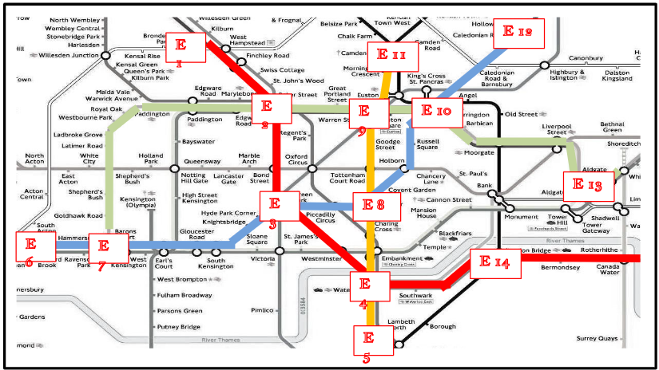
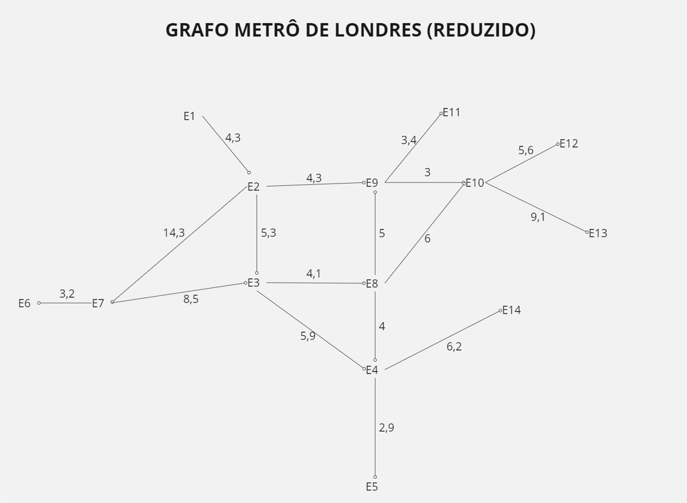

# Problema do Metrô de Londres - Busca Heurística com A* 
## Relatório de Atividade

___________________________________________________________________________________________________

Este repositório contém a implementação da segunda atividade da disciplina de Introdução a Agentes Inteligentes (IAI) do ano de 2024 da UFPE. A atividade consiste na aplicação do algoritmo A* para resolver o problema da busca de rotas no metrô de Londres.

## Mapa Reduzido

## Grafo das Estações com a distância real, em Km, entre cada nó

## Descrição do Problema

O problema consiste em calcular a melhor rota em um mapa "reduzido" do metrô de Londres, onde cada estação é um estado. O objetivo é encontrar a rota mais eficiente para ir de uma estação inicial para uma estação final.

### Estado Inicial
- Estação de partida selecionada pelo usuário.

### Estado Final (Objetivo)
- Estação de destino desejada.

### Ações e Custos
- As ações correspondem à movimentação entre as estações do metrô.
- O custo de cada ação pode variar dependendo da distância entre as estações ou outros critérios definidos.
  
### Função de Avaliação (Heurística)
- Para este problema, foi escolhida a heurística de distância euclidiana entre as estações. Essa heurística estima o custo restante para atingir o objetivo a partir de cada estado.

**Observação:** Este é um projeto desenvolvido como parte da segunda atividade da disciplina de Introdução a Agentes Inteligentes (IAI) de 2024 da UFPE. Responsáveis pela implementação: Gabriela Gimenez e Silvio Sá.

## Considere que:
* a distância em linha reta entre duas estações quaisquer é dada pela tabela 1 e a distância real é dada pela tabela 2.
* a velocidade média de um trem é de 40 km/h;
* o tempo gasto para trocar de linha dentro de mesma estação (fazer baldeação) é considerado igual para todos os casos, sendo de 3 minutos (para facilitar).

# Para responder: 

#### 1. (0,1 pt) Escolha uma função heurística para o problema escolhido. Veja os slides da aula sobre busca com A* e sobre funções heurísticas.
          A heurística escolhida foi o calculo da função Euclidiana da distancia

#### 2. (0,1 pt) Formule o problema escolhido em termos de estado inicial, estado final, ações (e seus custos) e função de avaliação para Busca com A*.
        * Estado inicial: Estação (E1)
        * Estado final: Estação (E13)
        * Ações e Custos: 
        * Função de Avaliação para Busca A*: 
#### 4. (0,2 pt) Desenhe pelo menos os 3 níveis iniciais da árvore de busca (raiz e mais 2 níveis) – pelo menos três rodadas do algoritmo. Indique o estado que o nó representa e seu custo (g+h), e escreva a fronteira a cada rodada (nível da árvore). Vejam o exemplo abaixo tirado dos slides da nossa aula.
        * 

## (1,1 pt) Parte automática: execução do código do A*
#### (0,5 pt) Imprima uma espécie de “LOG” de execução do algoritmo - a evolução da fronteira para o problema escolhido, começando com o nó raiz, até chegar ao objetivo definido na descrição dos problemas. Isto é, imprima a lista de nós da fronteira durante as execuções automáticas do algoritmo.
#### (0,4 pt) Indique na fronteira o custo de cada nó gerado pelo algoritmo. Lembre-se de que o custo das ações pode variar, dependendo do problema.
#### (0,2 pt) Retorne a solução (caminho completo) gerada pelo algoritmo com o custo final encontrado.

### Observações:
* É permitido o reuso de implementações disponíveis na internet.
* Relembro que, de acordo com nossa estratégia, cada nó da fronteira é uma estrutura de dados que guarda:
   * o estado do nó (estação do metrô ou configuração do tabuleiro do jogo)
   * o custo do nó, dado pela função f(n) = g(n) + h(n)
   * a ação realizada para gerar o nó (opcional se o nó já guardar o caminho percorrido todo – veja item a seguir)
   * ma lista com o caminho percorrido desde a raiz até o nó (i.e., os nós existentes naquele caminho – ex., as estações do metrô no caminho da raiz até o nó n)
* A lista aberta é a fronteira (nós a serem expandidos), e a lista fechada guarda os nós já expandidos, que foram retirados da fronteira e foram descartados porque não correspondem ao nó final (objetivo). A lista fechada é usada para o algoritmo recuperar a solução final (caminho conectado do nó inicial até o nó final) através de backtrack.  
